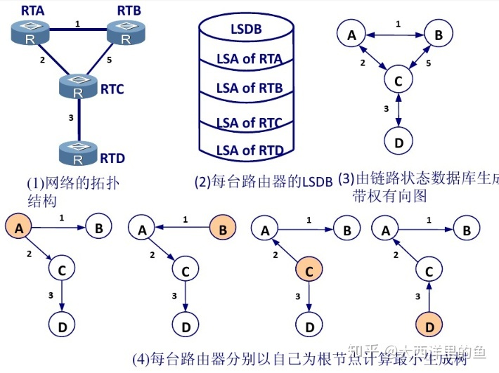

# HCIA-Datacom-Advanced Routing & Switching Technology

P1   企业网络架构、传输介质简介（网线）、以太网帧结构

p2   IP编址、ICMP协议、ARP协议（mac-ip对应关系）

P3   传输层协议、数据转发过程

## P4  VRP基础、命令行基础、文件系统基础、VRP系统管理

VRP（Versatile Routing Platform，通用路由平台）是华为公司数据通信产品的通用操作系统平台

基于自身路由和交换机开发的OS系统

## P5  交换网络基础

## P6  STP、RSTP、MSTP原理与配置 

BPDU（bridge Protocol data Unit）桥协议数据单元

MSTP  vlan

## P7  IP路由基础 

BGP IS-IS OSPF Static RIP  

黑洞路由  null0

## P8  静态路由基础（Static）

3-5台  static路由

## P9  距离矢量路由协议（RIP）

10台左右  RIP

RIP（Routing information Protocol）使用跳数度量网络距离  RIP不超过15跳   

特性：水平分割、毒性反转、触发更新

| RIP                            | （224.0.0.9 组播）     |
|---                             |---                    |
| RIPv1                          | 无链路协议             |
| RIPv2                          | 有链路协议             |


```bash
rip      metricin   metricout
rip      split-horizon                  #水平
rip      poison-reverse                 #毒性

undo rip output                         #禁止发送RIP报文
undo rip input                          #接收RIP报文

#抑制接口
silent-interface G 0/0/1
优先级大于rip input和output
```
## P10  链路状态路由协议OSPF

OSPF（Open Shortest Path First）开放式最短路径优先

1000台左右  路由表  8000个信息




| OSPF                             |                                                  |
|---                               |---                                               |
| 邻居表                           | 邻居关系（display ospf peer brief）                |
| LSDB                             | 链路状态信息，并需要实时同步（display ospf lsdb）   |
| 路由表                           |spf ospf中路由表单(display ospf route)              |

| OSPF报文类型                                      | 含义                     |
|---                                               |---                       |
| Hello报文                                        | 发现   维持               |
| DD（Database Description）报文                    | LSDB                     |
| LSR（LSA Request）报文                            | 请求LSA                  |
| LSU（LSA Update）报文                             | 提供LSA                   |
| LSACK（Link State Acknowledgment）报文            | 确认LSA                   |
      
Hello 邻居发现   
DD 路由交换

LSR LSU LSACK 路由计算 路由维护
Router ID 邻居 邻接

NBMA（非广播多路访问） 点到多点
DR&BDR       broadcast NBMA
OSPF区域     area ID 
OSPF开销      bandwidth-reference 10000
OSPF认证   


## P11  DHCP原理与配置

```ipconfig /release```
```ipconfig /renew```

地址池：全局地址池和接口地址池
DHCP中继
DHCP snooping
租期默认时间：86400s（一天24h）

## P12  FTP原理与配置

port 20、21
文件传输协议（File Transfer Protocol，FTP）是用于在 网络 上进行文件传输的一套标准协议
FTP两种传输方式：port 主动、pasu 被动
       传输模式：ASCII模式、传输文本、二进制模式、图片，程序文件

## P13  Telnet原理与配置

ssh

## P14  企业网络高级解决方案概述（eslight）

## P15  链路聚合

1. 增加带宽 2.提高可靠性 3. 负载分担

链路聚合模式：
1.手工负载分担：所有成员端口都处于转发状态
2.LACP模式

数据流控制：
基于流的负载分担
基于包的负载分担

注意：
1. 只能删除不包含任何成员接口的聚合口
2. 二层聚合口成员必须为2层，3层为3层
3. 最多可以8个成员端口
4. 加入到聚合口的接口必须是hybrid接口类型
5. 不能嵌套使用聚合
6. 一个成员接口只能属于一个聚合口
7. 聚合口的成员口类型必须相同
8. 两端都必须要配置聚合口
9. R1==R2 速率较低的接口可能拥塞或者丢包
10. 由聚合口来学习mac地址，成员端口就不再学习mac

## P16  GARP与GVRP

GARP（Generic Attribute Registration Protocol）：通用属性注册协议
GVRP是基于GARP的应用

GARP消息：Join、leave、leave all

GVRP应用           GVRP  单向注册   单向注销
注册模式：
1. Normal
2. Fixed（只发送静态vlan）
3. Forbidden


## P17  VLAN间路由

vlan路由：
1. 每个vlan一个物理连接
2. 单臂路由
3. 三层交换   vlanIF

## P18  WLAN概述

WLAN是Wireless Local Area Network的简称，无线局域网，wifi+wipa=wlan
802.11      802.11n         ac      ap


## P19  HDLC和PPP原理与配置

HDLC（High-level Data Link Control），高级数据链路控制，是一组用于在网络结点间传送数据的协议。
PPP（Point to Point Protocol）点对点协议，是Internet中广泛使用的数据链路层通信协议。

串口封装协议
同步/异步传输

HDLC  面向比特的链路层协议
PPP组件：   
1. LCP （Link Control Protocol） 链路控制协议
2. NCP （Network Control Protocol） 网络控制协议          ipcp ipxcp

认证：pap 明文           chap  密文
ppp动态学习对方IP地址
IPcp  静态/动态地址协商

## P20  PPPoe原理与配置

PPPoE（Point-to-Point Protocol over Ethernet）可以称作为以太网上的PPP协议，应用在链路层。
PPPoE（以太网点对点协议）是连接到ISP（互联网服务供应商）的常用方法

数字用户线路DSL（Digital Subscriber Line）
所有的DSL技术统称为xDSL
ADSL：非对称DSL技术

## P21  网络地址转换（NAT）

NAT（Network Address Translator，网络地址转换）是用于在本地网络中使用私有地址，在连接互联网时转而使用全局 IP 地址的技术。

| ABC三类地址                         | IP地址段                                 |
|---                                  |---                                     |
| A类地址                             | 10.0.0.0/8                              |
| B类地址                             | 172.16.0.0/16    ~   172.31.0.0/16      |
| C类地址                             |192.168.0.0/16                           |

静态NAT、动态NAT
NAPT：NA port T
EASYip是NAPT一种特殊的转换形式

NAT服务器


P22  企业无线解决方案

## P23  访问控制列表（ACL）

ACL（Access Control List）访问控制列表。它是由一系列条件规则（即描述报文匹配条件的判断语句）组成， 这些条件规则可以是报文的源地址、目的地址、端口号等，是一种应用在网络设备各种软硬接口上的的指令列表。

ACL应用场景：控制访问流量、定义过滤的条件以及匹配条件后的动作
Rule-id决定规则优先级
高级ACL配置：用于防控，注意接近源的位置配置
ACL应用-NAT

ACL即访问控制列表，主要用来实现流识别功能。

QoS即服务质量，主要用来对企业的网络流量进行调控。

## P24  aaa

aaa：Authentication（认证）、Authorization（授权）、Accounting（计费）
aaa域：对域对用户进行管理


## P25  IPsec VPN原理与配置

IPSec（Internet Protocol Security）：是一组基于网络层的，应用密码学的安全通信协议族

IKE ESP AH 安全联盟SA
IPsec：传输模式、隧道模式


## P26  GRE原理与配置 

GRE（Generic Routing Encapsulation）通用路由封装协议，是一种三层VPN封装技术。
GRE over IPSec
Key检测双端
Keepalive检测


## P27  SNMP原理与配置

SNMP（Simple Network Management Protocol）简单网络管理协议，是一个应用层协议，包含三个版本，包括SNMPv1、SNMPv2c和SNMPv3。
NMS：Network Management System


## P28  Esight简介

NTA（Network traffic Analyzer）组件：网络流量分析器


## P29  IPV6基础介绍、IPV6路由基础

|ipv4五元组                       |ipv6三元组                 |
|---                             |---                       |
|源目ip                           |源目ipv6                  |
|源目端                           |Flow label                |
|协议                             |                          |

IPv6拓展报头：路由、逐跳、目的选项、认证、封装净载、分片、安全
IPv6地址=网络前缀+接口标识

IPv6地址分配：
1. IPv6无状态地址自动分配
   RS： 请求前缀  RA： 提供接口地址
2. 手工
3. EUI-64规范
4. DHCPv6有状态地址自动分配

IPv6无状态地址DAD检查（重复地址）：
NS：  邻居请求  NA：  邻居通告

IPv6路由：RIPng、OSPFv3

ipv4RIP：UDP port  520、521

OSPFv3：
RID：OSPFv3中必须手动配置
OSPFv2是基于网络运行的，OSPFv3是基于链路的


## P30  DHCPv6原理与配置

动态主机配置协议DHCP（Dynamic Host Configuration Protocol）是一种网络管理协议，用于集中对用户IP地址进行动态管理和配置。

IPv6无状态自动缺陷：1.dns、域名需单独配置 2.不易管理
DHCPv6有状态自动分配
DUID：基于AGR3
1. LL——MAC——接口号码小
2. LLT

关于M及O比特的组合

M=0，O=0 应用于没有DHCPv6服务器的环境。主机使用RA消息中的前缀构造IPv6单播地址，同时使用其他方法（非DHCPv6），例如手工配置的方法设置其他配置信息（DNS等）。

M=1，O=1 主机使用DHCPv6来配置IPv6单播地址以及其他配置信息（DNS等）。这种应用也称为DHCPv6 Stateful。

M=0，O=1 主机使用RA消息获得的IPv6前缀构造IPv6地址，同时使用DHCPv6来获取除了地址之外的其他配置信息。这种应用也被称为DHCPv6 stateless。

M=1，O=0 主机仅仅使用DHCPv6来获取IPv6地址，至于其他配置信息则并不通过DHCPv6获得，这种组合不建议使用。 


---

## 华为书籍：移动通信技术、网络规划与优化技术、路由与交换技术、传输网络技术  